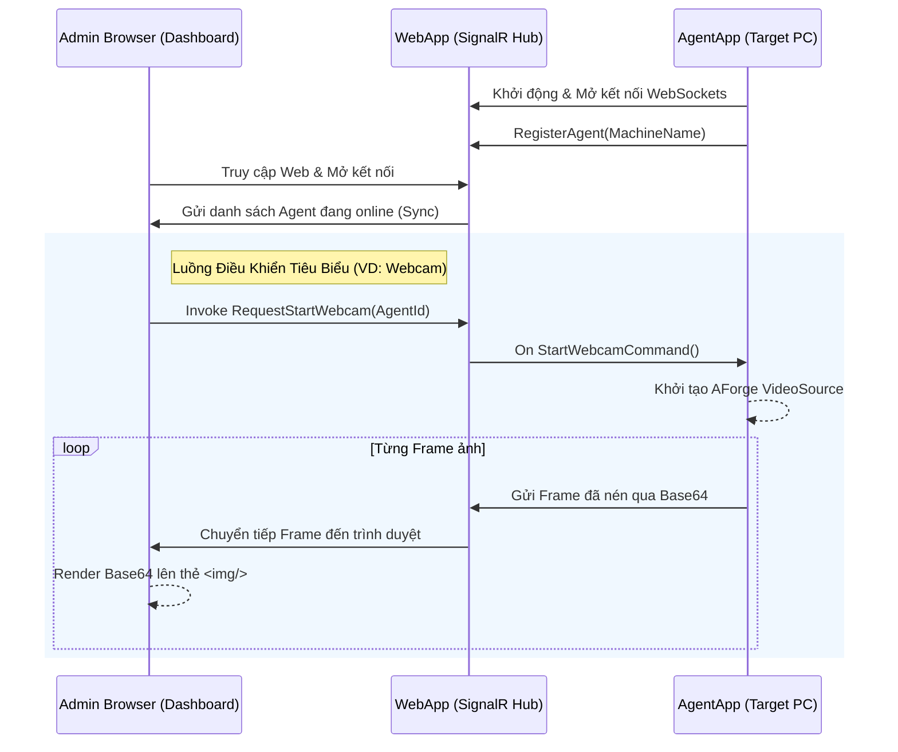
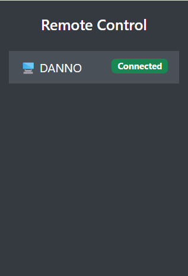
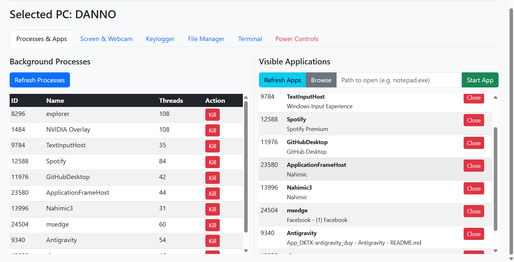
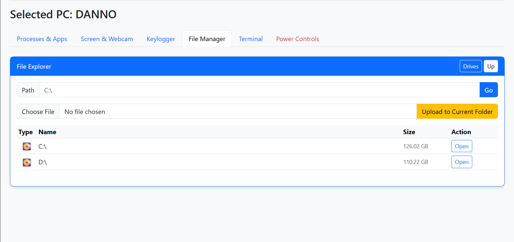
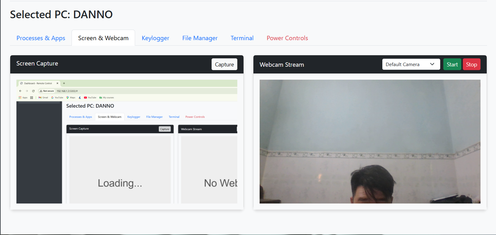
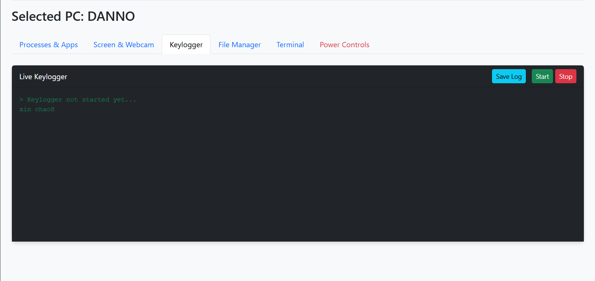
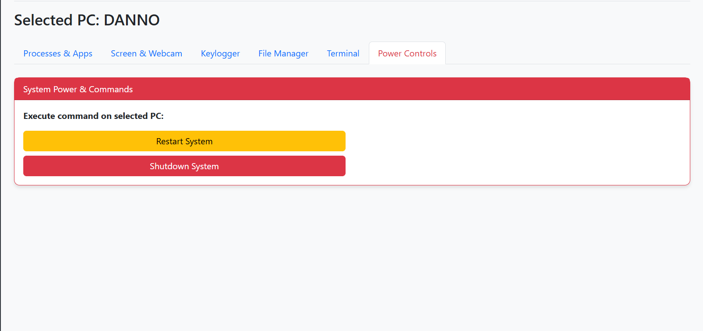

# 📋 Báo Cáo Tổng Quan: Ứng Dụng Điều Khiển Từ Xa Qua Web (Web-based Remote Control)

**Học phần:** Chuyên đề Tốt nghiệp Mạng máy tính - 22MMT  
**Topic 04:** XÂY DỰNG ỨNG DỤNG WEB HỖ TRỢ VIỆC ĐIỀU KHIỂN MÁY TÍNH TỪ XA

**Sinh viên thực hiện:** 
- 22127089 - Trần Lê Bảo Duy
- 22127439 - Võ Hữu Tuấn

**Giảng viên hướng dẫn:**
- Thầy Đỗ Hoàng Cường

---

## 1. Giới thiệu
Dự án được xây dựng với giải pháp quản lý nhiều phân máy tính (Client) từ xa bằng một giao diện Dashboard Web tập trung duy nhất mà không yêu cầu cài đặt phần mềm quản lý Client riêng cho Admin.

> **⚠️ TUYÊN BỐ MIỄN TRỪ TRÁCH NHIỆM (DISCLAIMER):**
> Dự án phần mềm này được phát triển **đơn thuần cho mục đích giáo dục, nghiên cứu học thuật và quản trị hệ thống nội bộ** (dưới sự cho phép của chủ sở hữu máy tính). Các tính năng như Keylogger, Remote Execution được thiết kế mô phỏng các công cụ quản trị hoặc phần mềm kiểm thử bảo mật. Nhóm tác xin miễn trừ trách nhiệm cho bất kỳ việc sử dụng phi pháp, đánh cắp thông tin hay xâm phạm quyền riêng tư nào gây ra bởi người dùng khi sử dụng phần mềm. 

---

## 2. Mô hình Kiến trúc & Luồng hoạt động

Kiến trúc của ứng dụng tuân thủ mô hình **Hub-Spoke** (Khách - Chủ) mạnh mẽ với sự hỗ trợ kết nối thời gian thực bằng `SignalR` qua WebSocket.



### Tổng quan Luồng hoạt động:
1. **Đóng vai trò điều phối trung tâm:** `WebApp` có một Hub có tên là `RemoteControlHub`.
2. **Quản lý trạng thái:** Hub sử dụng `ConcurrentDictionary` để lưu trữ cặp `[Id duy nhất : Thông tin PC]`. Các `AgentApp` khi chạy ngầm trên PC đích sẽ duy trì `Heartbeat` cứ mỗi 10 giây.
3. **Mô hình Broadcast / Direct Invoke:** Admin trên trình duyệt web khi bấm một lệnh, lệnh này truyền tới Server, Server tra cứu `TargetConnectionId` của PC đích và đẩy lệnh trực tiếp xuống máy đó. Máy đó thực thi và đẩy luồng kết quả lại lên Hub (Ví dụ: string JSON danh sách file, chuỗi Base64 hình ảnh, etc).

---

## 3. Các Tính Năng Đã Triển Khai & Phân Tích Kỹ Thuật

Mỗi một AgentApp được thiết kế theo dạng Multi-threaded để có thể thực thi nhiều lệnh cùng một lúc mà không bị treo.

### 3.1. Quản lý Đa Thiết Bị (Device Management)
- **Hoạt động:** Admin có thể theo dõi được ngay lập tức một máy PC nào đó Online, Offline hay bị ngắt mạng (Timeout cơ chế sau 60s không có Heartbeat).
- **Công nghệ:** Dùng `C# ConcurrentDictionary` kết hợp DateTime UTC. Trên Hub tích hợp hệ thống lắng nghe sư kiện `OnDisconnectedAsync`.


### 3.2. Quản lý Tiến Trình & Ứng Dụng (Process / App Manager)
- **Hoạt động:** Lấy danh sách quá trình chạy ngầm, danh sách ứng dụng có giao diện minh hoạ, và cho phép Kill hoặc Start 1 process.
- **Công nghệ:** Sử dụng phân lớp thư viện chuẩn `System.Diagnostics.Process` của .NET. Lọc ứng dụng GUI thông qua thuộc tính `MainWindowHandle != IntPtr.Zero`.


### 3.3. File Manager & Chuyển tập tin (Upload/Download)
- **Hoạt động:** Trình duyệt thư mục kiểu Explorer, xem danh sách Ổ đĩa, Folder, File cùng với kích cỡ. Cho phép Download file từ máy Agent về máy Admin và Upload tệp tin lên máy Agent vào thư mục chỉ định.
- **Công nghệ:** Sử dụng `System.IO.DriveInfo` và `System.IO.DirectoryInfo`. Dữ liệu tệp được mã hoá dạng Base64 Payload để gửi thẳng qua SignalR WebSockets mà không cần giao thức FTP/HTTP File Upload phụ trợ. Trình duyệt bắt Base64 và lưu với đối tượng mảng nhị phân tuỳ chỉnh (`Uint8Array` ra `Blob`).


### 3.4. Quét Webcam và Livestream
- **Hoạt động:** Ứng dụng quét tất cả các camera hiện có trên máy (bao gồm Virtual Camera), Admin chọn camera cần theo dõi và luồng stream lập tức hiện trên Web mượt mà.
- **Công nghệ:** Hệ thống sử dụng thư viện **AForge.Video** và **AForge.Video.DirectShow**. Khi bắt được `NewFrame`, Agent sử dụng luồng phụ clone `Bitmap` và lưu dưới dạng `ImageFormat.Jpeg` (nén ảnh), đổi ra Base64. Đặc biệt, thao tác COM Interop của DirectShow được cô lập vào một `.SetApartmentState(ApartmentState.STA)` thread chuyên dụng để tránh deadlock Win32.


### 3.5. Theo dõi Bàn phím (Live Keylogger)
- **Hoạt động:** Admin ấn nút Start, bất kỳ hành động gõ phím nào của thiết bị đích sẽ chạy thẳng về màn hình Terminal của trang Web với độ trễ thấp. Bắt đầy đủ Backspace, Enter, kết hợp Shift, Ctrl... Admin có thể export lưu log ra máy tính.
- **Công nghệ:** Triển khai **P/Invoke** (Platform code gọi vào API Windows C/C++ trực tiếp).
Sử dụng hàm:
```csharp
[DllImport("user32.dll")]
private static extern short GetAsyncKeyState(int vKey);
```
Sử dụng vòng lặp While Threading thăm dò 10ms (Polling) để quét trạng thái 255 phím ảo của hệ điều hành Windows. Kỹ thuật lọc Bit d(`(keyState & 1) == 1`) để đảm bảo không bị bắt trùng key.

Đặc biệt, hệ thống tự nhận biết được các phím đặc biệt như Shift, Ctrl, Alt, Tab, Caps Lock, và các phím chức năng (F1-F12) để hiển thị đúng ký tự hoặc trạng thái của phím.

Hơn thế, nếu hệ thống theo dõi nhiều Agents cùng lúc, hệ thống vẫn nhận biết phím đầu vào của mỗi Agents một cách chính xác nhờ kỹ thuật gán ID duy nhất cho mỗi Agent và gửi lệnh đến đúng ID đó.


### 3.6. Chụp Ảnh Màn Hình (Screen Capture)
- **Hoạt động:** Lấy ngay 1 frame hình ảnh của thiết bị đích màn hình chính hiện tại.
- **Công nghệ:** Dùng `System.Drawing.Graphics.CopyFromScreen()` hỗ trợ bởi GDI+ của Windows, kết hợp thư viện `System.Windows.Forms.Screen` để định dạng độ phân giải Desktop.


### 3.7. Terminal Từ Xa (Remote Shell execution)
- **Hoạt động:** Cho phép Admin ngầm thực thi cấu trúc lệnh Shell (CMD/PowerShell) như thư mục hệ thống, chỉnh sửa reg, thay đổi ip..
- **Công nghệ:** Cấu hình `ProcessStartInfo` với cờ `CreateNoWindow = true` và `RedirectStandardOutput`. Sau đó bắt đầu chạy lệnh qua chuỗi gọi `/c cmd.exe` để thu thập `StandardOutput` chuỗi phản hồi rồi gửi lên giao diện web.

### 3.8. Quản Lý Quyền Lực Hệ Thống (Power Control)
- **Hoạt động:** Restart và Shutdown cưỡng chế máy đích.
- **Công nghệ:** `Process.Start("shutdown.exe", "/s /t 0");` 
