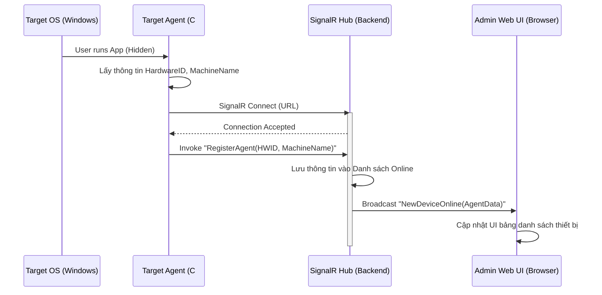
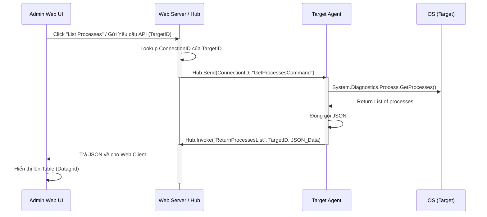
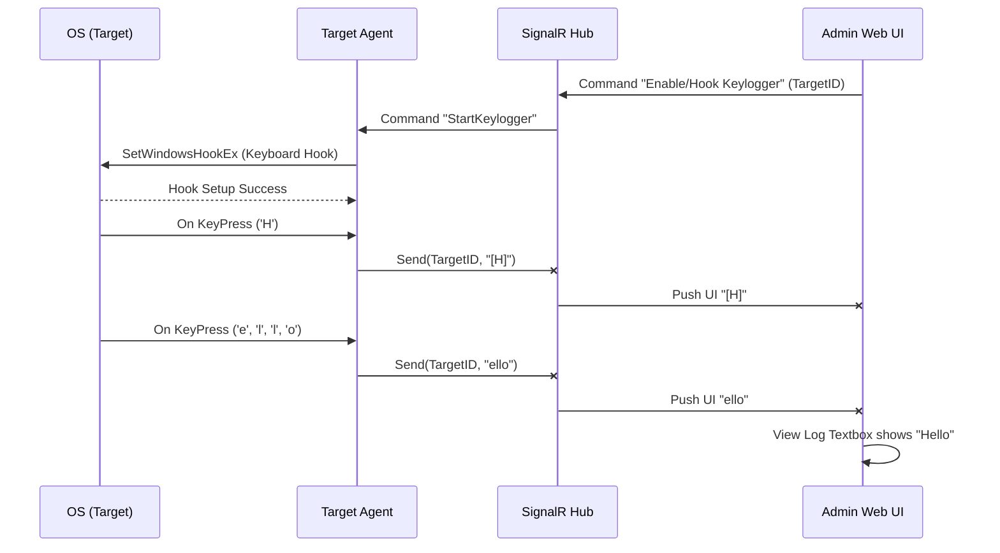

# Sơ đồ biểu diễn luồng dữ liệu (Sequence Diagrams)

Tài liệu này trình bày cách các thành phần trong hệ thống tương tác với nhau đối với các Request cơ bản và một số Request chuyên sâu.

## 1. Chu trình kết nối ban đầu và Cập nhật trạng thái (Connection & Registration)

Khi mục tiêu khởi động phần mềm Agent (ẩn danh).



## 2. Chu trình Gửi lệnh Yêu cầu dữ liệu (Ví dụ: Danh sách Tiến trình Process)

Admin muốn xem danh sách các ứng dụng/tiến trình đang chạy bên phía Agent.



## 3. Chu trình Nhận Tín hiệu Khối lớn (Ví dụ: Chụp Màn Hình Real-time)

Truyền dữ liệu dạng hình ảnh (Image Stream) khá nặng nền phải bóc tách bằng Base64 chunked data qua websockets.

```mermaid
sequenceDiagram
    participant Admin as Admin Web UI
    participant Backend as SignalR Hub
    participant Agent as Target Agent

    Admin->>Backend: Request "Start Screen Stream" (TargetID)
    Backend->>Agent: Command "CaptureScreenLoop" (TargetID, FPS=5)
    
    loop Every 200ms
        Agent->>Agent: Capture Graphics.CopyFromScreen -> JPEG
        Agent->>Agent: Convert to Base64 String
        Agent-xBackend: Invoke "ReceiveScreenFrame(TargetID, Base64_String)"
        Backend-xAdmin: Push "UpdateScreenFrame(TargetID, Base64_String)"
        Admin->>Admin: Update 
    end

    Admin->>Backend: Click "Stop Stream"
    Backend->>Agent: Command "StopCaptureScreen"
```

## 4. Chu trình Keylogger (Hook Event-driven)

Thay vì yêu cầu liên tục, Keylogger là kiến trúc hoạt động ngầm (Push từ dưới lên mỗi khi có sự kiện).


